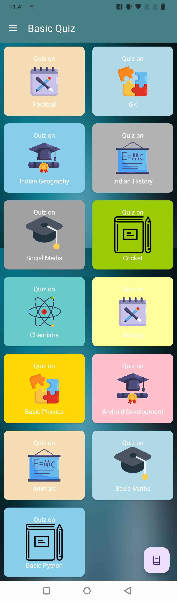
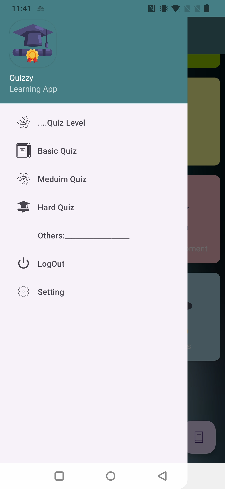
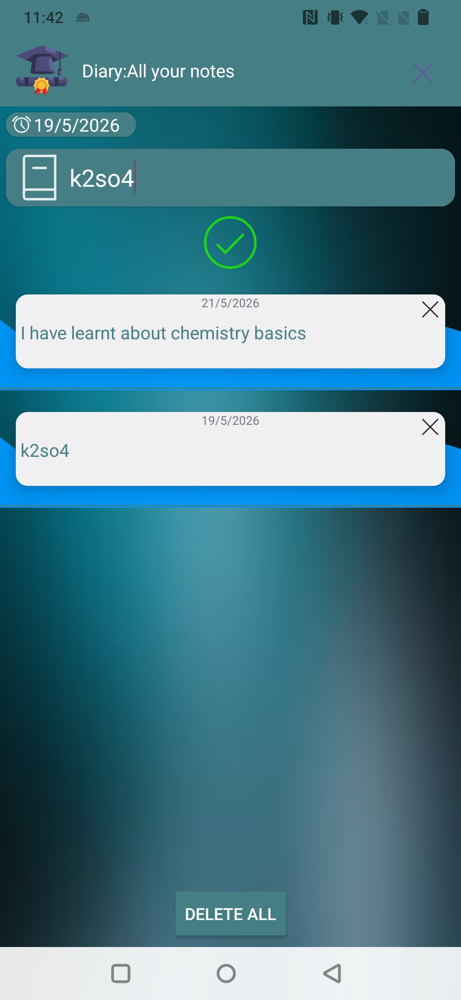
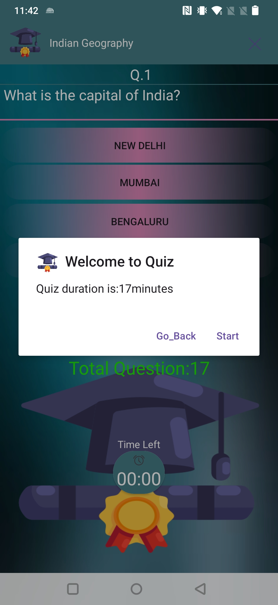
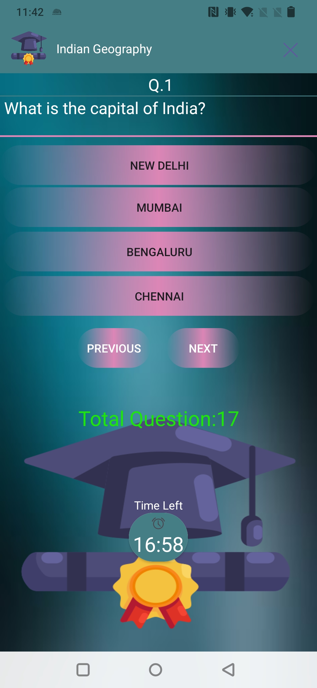

# Quiz_App 🧠

Quiz_App is a quiz application designed for testing and improving basic to intermediate general knowledge skills.

It helps users enhance their knowledge through interactive quizzes covering various topics with a simple, clean, and user-friendly interface.

This project is beginner-friendly and useful for learning Android development concepts like UI design, question handling, score tracking, and user interaction.

---

## ✨ Features

- Multiple-choice quiz questions
- Basic to intermediate general knowledge topics
- Score tracking system
- Instant answer validation
- Final result display
- Restart quiz option
- Clean and simple UI
- Beginner-friendly project structure

---

## 📱 Screenshots

<p align="center">
  
  
  
</p>

<p align="center">
  
  

</p>

## 🛠️ Built With

- Java / Kotlin (based on your project)
- Android Studio
- XML Layouts
- Android SDK

---

## 📂 Project Structure

```text
Quiz_App/
│
├── app/
├── gradle/
├── screenshots/
├── build.gradle
├── settings.gradle
└── README.md
